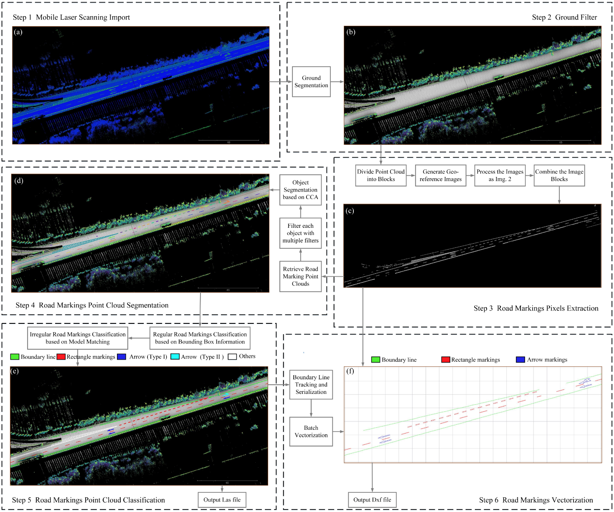

# LaneMarking
This repository refers to https://www.int-arch-photogramm-remote-sens-spatial-inf-sci.net/XLII-2-W13/1089/2019 ,which a C++ implementation of the automatic extraction, classification and vectorization of road markings from MLS point cloud. You can developement with docker(-compose) in this repository.


## How to use
```bash=
git clone https://github.com/moonstarsky37/LaneMarking.git
cd LaneMarking
docker compose up
```
* Enter this container (by docker exec or vs-code remote container) 
Then build the repository(when you first use or change the code in src):
```bash=
cd code
mkdir build
cd build
cmake .. 
make 
cd ..
```

3. Prepare the model matching pool (take `./model_pool/xxx` as an example) and configure the parameter list (take `./config/xxx.txt` as an example).

  * Parameters Notification
	1. road_type （1: highway, 2: urban road)
	2. point_density (expected average point density on road surface, X point/m^2) default: 900.0
	3. grid_resolution (projected grid size [unit:m]) default: 0.1 (if you show out of memory, you can change this parameter at first.)
	4. intensity_scale (controls the value range of point intensity. Generally, the smaller the value is, the more markings are found, and the more noise are found accordingly). recommended: 2.0-8.0, default: 5.0
	5. density_threshold (describes the approximate number of ground points in a single pixel on the road) recommended: 2.0-5.0, default: 2.5
	6. rotation_increment_step  (controls the increase step size of the initial estimate of the rotation angle during template matching. The larger the value, the more robust the template matching, but the longer time it would take) recommended: 15-45, default: 25.0
	7. matching_fitness_thre (controls the error threshold during template matching. The larger the value, the lower the accuracy and the higher the recall) preferred: 0.01-0.05, default: 0.02
	8. overlaping_distance_thre (controls the search radius [unit:m] of neighboring points when calculating the template matching overlap ratio. The larger the value, the higher the overlap ratio would be) recommended: 0.1-0.2 default: 0.15
	9. overlaping_ratio_thre (controls the criterion for judging that the template matching is successful, that is, the overlapping ratio between the template model and the scene point cloud. The larger this value is, the corresponding matching accuracy would be higher and the recall would be lower) recommended: 0.7-0.8 default: 0.75
	10. sideline_vector_distance (controls the distance threshold [unit: m] for vectorization of long edges. Adjacent edges whose endpoint distance is less than this threshold will be connected into a segment; in addition, the vectorized sampling points will also use this value as the sampling interval) recommended: 3.0-6.0 default: 4.5
	11. visualization_on (1:on, 0:off) default: 0

4. Configure the input (`*.las` or `*.pcd` point cloud) and output path in `./script/run_xxx.sh`.

5. Run `sh ./script/run_xxx.sh`. 

6. Check the results in your output folder. You may use CloudCompare to visualize the point cloud and use AutoCAD or [ShareCAD](https://beta.sharecad.org/) to visualize the dxf files.

------
### Citation
Since this repo is modified from this paper.
If you find this code useful for your work or use it in your project, please consider citing:

```
@article{pan2019automatic,
  title={Automatic Road Markings Extraction, Classification and Vectorization from Mobile Laser Scanning Data.},
  author={Pan, Yue and Yang, B and Li, S and Yang, H and Dong, Z and Yang, X},
  journal={International Archives of the Photogrammetry, Remote Sensing \& Spatial Information Sciences},
  year={2019}
}
```

[paper link](https://www.int-arch-photogramm-remote-sens-spatial-inf-sci.net/XLII-2-W13/1089/2019/)

### Workflow
 
### Image Processing
 
### Demo
 
 
